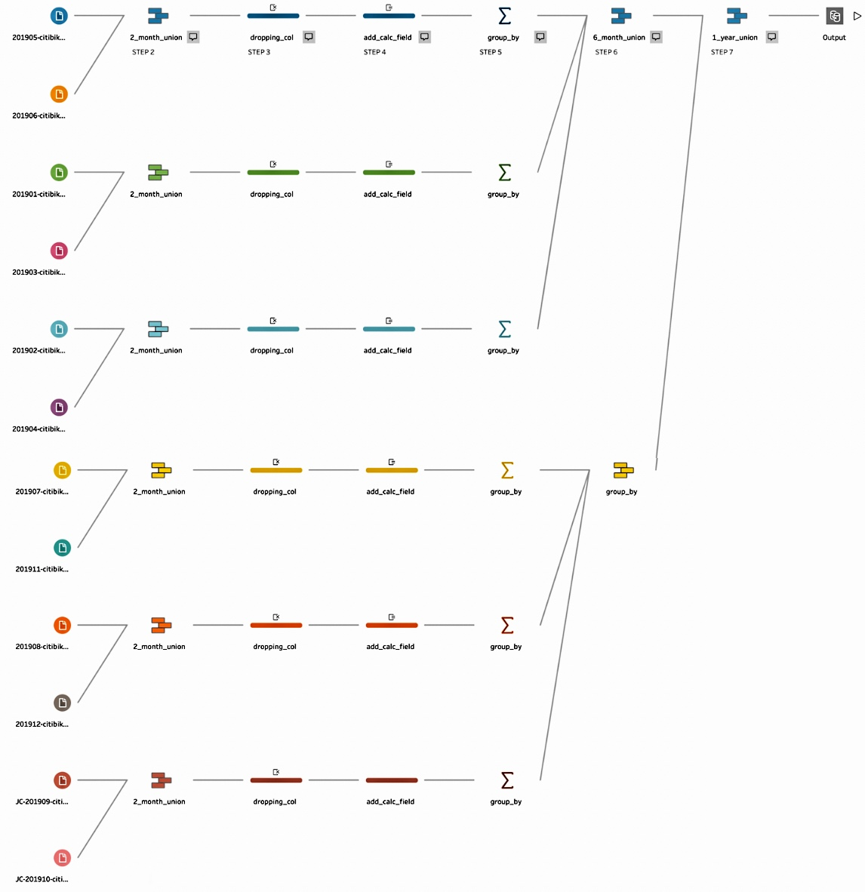

<p>&nbsp;</p>
<p>&nbsp;</p>

</div> 
<center>


</center>
<p>&nbsp;</p>
<p>&nbsp;</p>

     
# <span style="color: #2171b5;">**Framing the Problem**</span>


## <span style="color: #a6bddb;">*Problem Recognition*</span>

The business problem analyzed in the present paper is the investigation of the consumer's behavior towards the use of *"Citi Bike"* in New York City (NYC) from 2018 to 2020. Through the application of analytical and descriptive statistical concepts and the use of specific R programming tools, this paper aims to explain the variance of NYC Citi Bike rides within the examined time frame by identifying potential explanatory variables and answering specific questions, such as *"Does the user gender affect the decision to take a ride with NYC Citi Bike?"*, to properly understand which of the chosen variables can be considered *"statistically significant"*. The analysis of the *"NYC Citi Bike"* user’s behavior will also provide useful insights on any missed opportunity of attracting new potential costumers' segments or improving retention within the existing ones.

<p>&nbsp;</p>

## <span style="color: #a6bddb;">*Review of Previous findings*</span>

During the last decade, NYC has seen an unpreceded increase in the number of residents, jobs, and tourists. This has inevitably caused a growing demand for transportation. 
Moreover, the rise of several green movements and the consequent mutating New Yorkers' behavior, healthier and more environmentally friendly, has led to a natural change in the use and the choice of different types of transport. 

*“Now more than ever we see that there’s widespread demand to bike around NYC"*, said @Katherine Willis, an activist of *Transportation Alternatives*. New Yorkers are shifting towards cycling as a preferred way of moving (Raskind and Meyer, 2020) as cycling in NYC is cheaper and faster than fuel-powered transportation, plus it is eco-friendly. An unpreceded shift that has also been caused by the coronavirus pandemic, which has provoked the biking explosion, increasing the active travels by 42% globally. Therefore, as mentioned also in the WSJ (2020a), this disruption is posing a unique opportunity for the NYC urban cycling to acquire new ground and gain more market share (WSJ, 2020b).

In such a scenario, *"Citi Bike"* is the leader in the NYC bike-sharing system and the demand for its bikes is increasing at a record high.

<p>&nbsp;</p>
<p>&nbsp;</p>

# <span style="color: #2171b5;">**Solving the problem**</span>

## <span style="color: #a6bddb;">*Data Collection and Variable Selection*</span>

The main data source used is the *"NYC Citi Bike Trip History”*, published on the *Citi Bike* website, which gathers hourly historical data about the NYC Citi Bike’s rides between 2018 and 2020 from each of its bike station, counting for 1,212,194 observations and 8 variables. Follow the dataset’s variables: year, month, day, daily time slots, user type, user gender, and user birth year.

A secondary data source was used. This is the *"NYC Weather History"* published by the *Weather Underground* website, which gathers daily historical data about NYC weather between 2018 to 2020, counting 1,071 observations and 9 variables. Follow the dataset’s variables: year, month, day, average temperature (F), average dew point (F), average humidity (%), average wind speed (mph), average pressure, and total precipitation(in). This was used in support of the Citi Bike usage investigation.


<p>&nbsp;</p>


# <span style="color: #2171b5;">**Data Wrangling: Cleaning, Structuring and Transforming **</span>

```{r Data and Library Loading, include=FALSE}

# Loading Libraries
library(tidyverse)
library(ggthemes)
library(knitr)
library(scales)
# install.packages("kableExtra")
library(kableExtra)
# install.packages("extrafont")
library(extrafont)
# install.packages("hrbrthemes")
library(hrbrthemes)
import_roboto_condensed()
# install.packages("pixiedust")
library(pixiedust)
library(broom)


# Loading NYC Citi Bikes Trip History Dataset (2018-2020)
nyc_citibikes <- read_csv("NYC_Citi_Bike_2018-2020_Final_Dataset.csv")

# Loading NYC Weather History Dataset (2018-2020)
nyc_weather <- read_csv("NYC_Weather_Final_Dataset_2018-2020.csv")

```

## <span style="color: #a6bddb;">*The NYC Citi Bikes Trip History Dataset (2018-2020)*</span>

### <span style="color:  #bdbdbd;">*Data Cleaning with Tableau Prep*</span>

Since R not support the size of the original *"The NYC Citi Bikes Trip History Dataset"*, giving the error **"Error: cannot allocate vector of size 6.2 Gb in R”**, it has been tidied and partially cleaned using Tableau Prep. 
Below the list of the steps followed to reduce the original dataset of 18M observations and 11 variables to 1.2M observations and 8 variables:

   - **STEP 1**: The 12 NYC Citi Bike monthly datasets of each year have been connected to a specific workflow.
  
  - **STEP 2**: In each workflow, the 12 NYC Citi Bike monthly datasets have been clustered into groups of two using the union function.
  
  - **STEP 3**: Each bimonthly union has been cleaned by deleting all the unnecessary variables, decreasing the union width from 11 to 8.
  
  - **STEP 4**: In each bimonthly union a calculated field has been created, using the *IF()* and *DEPART()*, functions to identify the daily time slots in which each observation has been recorded. As a consequence, a new column called *“Daily_Time_Slots”* has been created, with the following categories: *Early Morning, Late Morning, Early Afternoon, Late Afternoon, Evening, and Late Evening*.
  
  - **STEP 5**: Each bimonthly union observation has been first grouped by *year, month, day, daily_time_slot, user_type, gender*, and *user_birth_year*. Then, a new column called *“Rides_Count”* has been created to properly calculate the distinct counts of the recorded observation based on the identified groups.
  
  - **STEP 6**:A union of the 6 bi-monthly unions has been created.
  
  - **STEP 7**:The created flow has been run to properly create and save the cleaned output.
  
<p>&nbsp;</p>

Below, an example of the work done Tableau Prep workflow, in which the previous steps have been applied. Note that same process has been followed three times, one for each year.

<p>&nbsp;</p>

</div> 
<left>

</left>

<p>&nbsp;</p>
<p>&nbsp;</p>

### <span style="color: #bdbdbd;">*Data Cleaning with R*</span>

To properly examine each variable within the dataset, the first five rows have been displayed using the head() function. After having depicted the the original dataset, converting some variables’ data types proved essential and required specific data manipulations. For example, the *"Daily_Time_Slots"* data type has been converted from double to factor using the as.factor() function. 
Moreover, the two levels of the categorical variable *"User_Gender"* have been renamed by name changing 1 to *"Male"* and 2 to *"Female"*. The same approach has been applied to rename the *“Customer”* level of the categorical variable *"User_Type"* to *“Occasional”*. Lastly, three new variables, *"Age"*, *"Age Group"* and *"Season"*, have been created using the mutate() function and joined to the original *"nyc_citibikes"* dataset, creating a new one called *"nyc_citibikes_wrangled"*. 
Following the highlighted chunks hold the code of some of the most important data wrangling operations performed.


<p>&nbsp;</p>

```{r Citi Bikes Data Wrangling Part 1, include=FALSE}

# Changing "Year" variable data type from double to integer 
nyc_citibikes$Year <- as.integer(nyc_citibikes$Year)
class(nyc_citibikes$Year)

# Changing "Month" variable data type from double to integer 
nyc_citibikes$Month <- as.integer(nyc_citibikes$Month)
class(nyc_citibikes$Month)

# Changing "Day" variable data type from double to integer 
nyc_citibikes$Day <- as.integer(nyc_citibikes$Day)
class(nyc_citibikes$Day)

# Changing "Daily_Time_Slots" variable data type from double to factor 
nyc_citibikes$Daily_Time_Slots <- as.factor(nyc_citibikes$Daily_Time_Slots)
class(nyc_citibikes$Daily_Time_Slots)

# Changing "User_Type" variable data type from character to factor
nyc_citibikes$User_Type  <- as.factor(nyc_citibikes$User_Type)
class(nyc_citibikes$User_Type)

# Changing "User_Gender" variable data type from double to factor
nyc_citibikes$User_Gender <- as.factor(nyc_citibikes$User_Gender)
class(nyc_citibikes$User_Gender)

# Changing "User_Type" variable data type from double to factor
nyc_citibikes$User_Type <- as.factor(nyc_citibikes$User_Type)
class(nyc_citibikes$User_Type)

```

```{r Citi Bikes Data Wrangling Part 2, echo=TRUE}

# Renaming "User_Gender" levels 
levels(nyc_citibikes$User_Gender) <- c("Male", "Female")

# Renaming "User_Type" levels 
levels(nyc_citibikes$User_Type) <- c("Occasional", "Subscriber")

```

```{r Citi Bikes Data Wrangling Part 3, echo=TRUE}
# Creating a new numerical variable that specifies the user age
Age <- mutate(nyc_citibikes,Age = 2020 - User_Birth_Year)
```


```{r Citi Bikes Data Wrangling Part Age_Group, include=FALSE}
# Creating a new categorical variable that specifies the age group of the NYC Citi Bike Users 
Age_Group <- mutate(Age, Age_Group = ifelse(Age %in% 16:33, "Young Adults",
                                               ifelse(Age %in% 34:48, "Adults", 
                                                     ifelse(Age %in% 48:62, "Middel-Aged Adults", 
                                                         ifelse(Age %in% 63:80, "Elderly", NA)))))

# NOTE: Some age data, of those over   than 80 years old, are contaminated by erroneous birthdates. In the following section a detailed explanation of the detection of these data will be provided.
```


```{r Citi Bikes Data Wrangling Part 3 Season, echo=TRUE}
# Creating a new categorical variable that specifies the seasons of the year
Season <- mutate(nyc_citibikes, Season = ifelse(Month %in% c(12, 1, 2), "Winter",
                                                ifelse(Month %in% c(3, 4, 5), "Spring",
                                                       ifelse(Month %in% c(6, 7, 8), "Summer", 
                                                              ifelse(Month %in% c(9, 10, 11), "Fall", NA)))))

```


```{r Citi Bikes Data Wrangling Part 4, include=FALSE}

# Binding the new variables to "nyc_citibikes" 
nyc_citibikes_wrangled_0 <- inner_join(Season, Age, by = NULL )
nyc_citibikes_wrangled <- inner_join(nyc_citibikes_wrangled_0, Age_Group, by = NULL )

# Changing "Season" variable data type from character to factor
nyc_citibikes_wrangled$Season <- as.factor(nyc_citibikes_wrangled$Season)

```

<p>&nbsp;</p>

To better visualize the new wrangled dataset, the first 5 rows of *"nyc_citibikes_wrangled"* have been displayed.

<p>&nbsp;</p>

```{r Citi Bikes Data Wrangling Part 5, echo=FALSE}

# Final check of the new wrangled dataset
kable(head(  nyc_citibikes_wrangled, 5), booktabs = TRUE, ) %>%
  row_spec(2, color = 'black', background = 'gainsboro') %>%
  row_spec(4, color = 'black', background = 'gainsboro') %>%
  kable_styling(font_size = 9)

```

<p>&nbsp;</p>

## <span style="color: #a6bddb;">*The NYC Weather History Dataset (2018-2020)*</span>

After having depicted the first rows of the original dataset, converting some data types proved again essential for the *The NYC Weather History Dataset* and required specific data manipulations. Moreover, a new variable called *"Season"* has been created using the mutate() and joined to the initial *"nyc_weather"* dataset, generating a new one called *"nyc_weather_wrangled"*.
Lastly, all the variables' names have been renamed to facilitate the reading and the analysis of the dataset. 
Following the highlighted chunk holds the code of one of the most important data wrangling operation performed.

<p>&nbsp;</p>

```{r NYC Weather History Data Wrangling Part 1, include=FALSE}

# Checking the variables data type 
print(nyc_weather, n = 10)

# Changing "Year" variable data type from double to integer 
nyc_weather$Year <- as.integer(nyc_weather$Year)
class(nyc_weather$Year)

# Changing "Month" variable data type from double to integer 
nyc_weather$Month <- as.integer(nyc_weather$Month)
class(nyc_weather$Month)

# Changing "Day" variable data type from double to integer 
nyc_weather$Day <- as.integer(nyc_weather$Day)
class(nyc_weather$Day)

```

```{r NYC Weather History Data Wrangling Part 2, include=FALSE }

# Creating a new categorical variable that specifies the seasons of the year
nyc_weather_wrangled <- mutate(nyc_weather, Season = ifelse(Month %in% c(12, 1, 2), "Winter",
                                                ifelse(Month %in% c(3, 4, 5), "Spring",
                                                       ifelse(Month %in% c(6, 7, 8), "Summer", 
                                                              ifelse(Month %in% c(9, 10, 11), "Fall", NA)))))

# Changing "Season" variable data type from character to factor
nyc_weather_wrangled$Season <- as.factor(nyc_weather_wrangled$Season)
class(nyc_weather_wrangled$Season)

# rename variable where name is "Temperature_(° F)_Avg"
names(nyc_weather_wrangled)[names(nyc_weather_wrangled) == "Temperature_(° F)_Avg"] <- "Avg_Temperature"

# rename variable where name is "Humidity_(%)_Avg"
names(nyc_weather_wrangled)[names(nyc_weather_wrangled) == "Humidity_(%)_Avg"] <- "Avg_Humidity"

# rename variable where name is "Wind_Speed_(mph)_Avg"
names(nyc_weather_wrangled)[names(nyc_weather_wrangled) == "Wind_Speed_(mph)_Avg"] <- "Avg_Wind_Speed"

# rename variable where name is "Dew_Point (° F)_Avg"
names(nyc_weather_wrangled)[names(nyc_weather_wrangled) == "Dew_Point (° F)_Avg"] <- "Avg_Dew_Point"

# rename variable where name is "Pressure _(Hg)_Avg"
names(nyc_weather)[names(nyc_weather) == "Pressure _(Hg)_Avg"] <- "Avg_Pressure"

```

```{r NYC Weather History Data Wrangling Part 3, echo=TRUE}

# Example of renaming a variable
names(nyc_weather_wrangled)[names(nyc_weather_wrangled) == "Precipitation_(in)_Tot"] <- "Total_Precipitation"

```

<p>&nbsp;</p>

The first five rows of the new dataset, *"nyc_weather_wrangled"*, have been displayed to highlight the data manipulations results made throughout the data wrangling process. 

<p>&nbsp;</p>

```{r NYC Weather History Data Wrangling Part 4, echo=FALSE}

# Final check of the new wrangled dataset

kable(head( nyc_weather_wrangled, 5), booktabs = TRUE, ) %>%
  row_spec(2, color = 'black', background = 'gainsboro') %>%
  row_spec(4, color = 'black', background = 'gainsboro') %>%
  kable_styling(font_size = 9)

```

<p>&nbsp;</p>
<p>&nbsp;</p>


# <span style="color: #2171b5;">**Data Analysis**</span> 

## <span style="color: #a6bddb;">*Citi Bike Users: Age Impact on NYC Citi Bike Rides*</span>

By analyzing the users' age distribution in depth, some erroneous users’ birthdates have been detected. Since these values are contaminating the age distribution of the Citi Bike users and might lead to data distortion and false investigation results, it is necessary to drop all of them before moving on with the analysis. 
Calling each user to verify the birthdate and age would have been on top of too expensive and time-consuming, not feasible at all. Instead, the age distribution quantiles and common sense have been used to decide which age values drop.

<p>&nbsp;</p>

### <span style="color: #bdbdbd;">*Dropping the Contaminated Data *</span>

To better understand the distribution of the *“Age”* variable, the quantiles have been calculated. According to the quantile analysis, the contaminated age range mainly between 102 and 163 years old. However, common sense suggests that a user of 102 would not ride a bicycle. Moreover, in 2019 it has been estimated that the United States life expectancy was equal to 78.87 years. Therefore, it has been decided to drop all the age values greater than 80. All the erroneous data, which were affecting the 3.9% of the total observations, have been filtered out from the *"nyc_citibikes_wrangled"* and a new object called *"nyc_citibikes_not_contaminated"* has been created to store the filtered dataset (1,184,441 observations; 10 variables).

<p>&nbsp;</p>

```{r Dealing with User Age Contaminated Data Part 1, echo=FALSE}

# Plotting the Citi Bike users age distribution density
ggplot(nyc_citibikes_wrangled, aes(x = Age)) +
  geom_density(fill = "#a6bddb", color = "white", bw = 4, alpha = .7) + 
  geom_vline(xintercept = 80, color="#CC0000") +
  labs(title = "Citi Bike Users Age Distribution", subtitle = "Detecting Contaminated Data", x = "Age", y = " ") +
  theme_pander()

```

```{r Dealing with User Birth Age Outliers Part 3, include=FALSE}

# Dropping the contaminated ages from the nyc_citibikes_wrangled dataset
nyc_citibikes_not_contaminated <- nyc_citibikes_wrangled %>%
  filter(Age < 80)

```

Dropped all the contaminated values, the mean age of Citi Bike users is 44 years old. A smaller and more significant mean value than the one, equal to 46 years, that would have been obtained by not dropping the erroneous values.

<p>&nbsp;</p>

```{r Not Contaminated Age Summary, echo=FALSE, message=FALSE, warning=FALSE}

# Summarise without contaminated data 
nyc_citibikes_not_contaminated %>%
  summarize(mean(Age), median(Age), sd(Age))

```

<p>&nbsp;</p>

### <span style="color: #bdbdbd;">*Testing the First Investigation Hypothesis*</span>

Before testing the hypothesis, a bar chart between age and rides has been plotted to find whether or not exist an underlying pattern between the two variables. Looking at the graph it is possible to see a negative relationship between age and rides count. 

<p>&nbsp;</p>

```{r Finding Underlying Patterns 1, echo=FALSE}
ggplot(nyc_citibikes_not_contaminated) +
  geom_bar(mapping = aes(x = reorder(Age_Group, - Rides_Count)),fill = "#a6bddb", color = "white", alpha = .7) +
  labs(title = "Finding Underlying Patterns", subtitle = "Age & Rides", x = "Age", y =  "Rides") +
  theme_pander()
```
<p>&nbsp;</p>

Now, let's test the **first investigation hypothesis**: *“The user age has an effect on the NYC Citi Bike rides”* as follow:

$$
\begin{aligned}
H_0 &: \text{The user age has no effect on the NYC Citi Bike rides} \\
H_A &: \text{The user age has an effect on the NYC Citi Bike rides}
\end{aligned}
$$
<p>&nbsp;</p>

If the output of the following linear model will prove the null hypothesis, the first investigation hypothesis should be reconsidered. Moreover, since the *"Rides_Count"* distribution is highly skewed a log transformation is required.

<p>&nbsp;</p>

$$
\text{log(Rides)} = \beta_0 + \beta_1 \text{(Age)} + \epsilon
$$
```{r Testing Hypothesis 1, echo=FALSE}

# Creating the model to test the hypothesis 
fit_age <- lm(log(Rides_Count) ~ Age, data = nyc_citibikes_not_contaminated)

# Summarizing the results
broom::tidy(fit_age)

```


<p>&nbsp;</p>

The model created has an intercept equal to **3.745** and a slope equal to **-0.024**. If the user age increases by one unit, the expected rides decrease by 0.024 unit on average. Moreover, the p-values are very close to zero, meaning that the explanatory variable *"Age"* is highly significant. Therefore, we can reject the null hypothesis which allows us to conclude that there is a negative relationship between age and rides count.To conclude, **the first investigation hypothesis can be confirmed**.


```{r Merging Weather and Citi Bike datasets, include=FALSE}

nyc_total <- merge(nyc_citibikes_not_contaminated,nyc_weather_wrangled,by=c("Year","Month", "Day", "Season"))

```

<p>&nbsp;</p>
<p>&nbsp;</p>

## <span style="color: #a6bddb;">*Citi Bike Users: Gender impact on NYC Citi Bike Rides*<span>
The following bar chart has been plotted to investigate the existence of underlying trends in Citi Bike rides based on the user's gender. 
<p>&nbsp;</p>

```{r Female or male, echo=FALSE}

# Plotting rides count per User_Gender using ggplot() and geom_bar()
ggplot(data = nyc_citibikes_not_contaminated) +
  geom_bar(mapping = aes(x = Year, fill = User_Gender), position = "dodge", alpha = .7) +
  labs(title = "Rides count per user gender ", x = "", y = "") +
  theme_pander() +
  theme(legend.position = "bottom", legend.title = element_blank()) +
  scale_fill_manual(values = c("#a6bddb", "mistyrose2"))

```

<p>&nbsp;</p>

Males have been the leading user segment of Citi Bike from 2018 to 2020. From 2018 to 2019, the Male usage of Citi Bike has increased by 17.42% (moving from 11,950,869 to 14,032,973 total rides), while the female usage has increased by 20.59% (moving from 4,086,438 to 4,927,933 total rides). Moreover, while from 2020 to 2019, the Citi Bike usage has instead decreased by 21,05% for males, it has increased by 6.4% for females. Overall, the total rides count increased by 18,23% from 2018 to 2019 and decreased by 13.92% from 2019-2019 following the usage trend in male users. 

<p>&nbsp;</p>

```{r Not Contaminated User Gender Summary 1, echo=FALSE, message=FALSE, warning=FALSE}

# Using summarise() to find the total rides by user_gender and year
nyc_citibikes_not_contaminated  %>% 
  group_by(User_Gender, Year) %>% 
  summarise(Total_Rides = sum(Rides_Count))%>% 
  arrange(Total_Rides)

```
<p>&nbsp;</p>

```{r Not Contaminated User Gender Summary 2, echo=FALSE, message=FALSE, warning=FALSE}

# Using summarise() to find the total rides by year 
nyc_total %>% 
  group_by(Year) %>% 
  summarise(Total_Rides = sum(Rides_Count))%>% 
  arrange(Total_Rides)

```

<p>&nbsp;</p>

### <span style="color: #bdbdbd;">*Testing the Second Investigation Hypothesis*</span>

For the underlined pattern between user gender and Citi Bike rides just discovered, a **second investigation hypothesis**, *“The user gender has an effect on the NYC Citi Bike ride”*, should be tested as follow: 

<p>&nbsp;</p>

$$
\begin{aligned}
H_0 &: \text{The user gender has no effect on the NYC Citi Bike rides} \\
H_A &: \text{The user gender has an effect on the NYC Citi Bike rides}
\end{aligned}
$$

<p>&nbsp;</p>

If the output of the following linear model will prove the null hypothesis, the second investigation hypothesis should be reconsidered. 

<p>&nbsp;</p>

$$
\text{log(Rides)} = \beta_0 + \beta_1 \text{(User Gender)} + \epsilon
$$

```{r Testing Hypothesis 2, echo=FALSE}

# Creating the model to test the hypothesis 
fit_gender <- lm(log(Rides_Count) ~ User_Gender, data = nyc_citibikes_not_contaminated)

# Summarizing the results
broom::tidy(fit_gender)
```
<p>&nbsp;</p>

The model created has an intercept equal to **2.97** and a slope equal to **-0.63** if the user gender is female. The p-value for the dummy variable *“User_GenderFemale”* is very significant, suggesting that there is a statistical evidence of a difference in NYC Citi Bike rides between genders. Therefore, we can reject the null hypothesis and **the second investigation hypothesis can be confirmed**. In detail, a female addition within the NYC Citi Bike users' base, decreases the NYC Citi Bike rides by -0.631 on average.

<p>&nbsp;</p>
<p>&nbsp;</p>

## <span style="color: #a6bddb;">*Citi Bike Users: The Impact of User Type on Seasonal NYC Citi Bike  Rides*<span>

The following charts have been plotted to investigate the existence of underlying trends in Citi Bike rides based on user type and season. 

<p>&nbsp;</p>

```{r Rides Count per Season, echo=FALSE}

# Plotting rides count per user type by season using ggplot(), geom_bar() and facet_wrap()
ggplot(data = nyc_citibikes_wrangled, aes(x = Year, fill = User_Type)) +
  facet_wrap(~Season) +
  geom_bar(alpha = .7) +
  labs(title = "The Impact of User Type on Seasonal Rides", x = "", y = "") +
  theme_pander() + 
  theme(legend.position = "bottom", legend.title = element_blank()) +
  scale_fill_manual(values = c("#a6bddb", "lightgrey"))

```

<p>&nbsp;</p>

Subscribers users have been the leading NYC Citi Bike user type segment from 2018 to 2020, reaching a total of 46,355,536 rides and, consequently, representing the 90.32% of the total usage. Values significantly higher than the ones registered for occasional users, which have only reached a total of 4,964,985 in the last three years. For both user types the best time to cycling is Summer, which has reached within 2018 and 2020 a total of 16,715,023 rides, followed by Fall, Spring, and Winter. As common sense might suggest, Winter is the least favorite season to ride a bicycle, counting only the 14.56% of the total rides registered between 2018 and 2020. Moreover, throughout the various seasons, while the number of subscribers remains similar, the number of occasional users varies largely probably due to a greater influx of international and non-international tourists in specific seasons of the year.
To, conclude the plotted graphs and the analyzed data summary show an underlying pattern between rides count, user type and season.  

<p>&nbsp;</p>

```{r Not Contaminated Summary 3, echo=FALSE, message=FALSE, warning=FALSE}

# Using summarise() to find the total rides by user_type
nyc_total %>% 
  group_by(User_Type) %>% 
  summarise(Total_Rides = sum(Rides_Count))%>% 
  arrange(Total_Rides)

```
<p>&nbsp;</p>
```{r Not Contaminated Summary 4, echo=FALSE, message=FALSE, warning=FALSE}

# Using summarise() to find the total rides by user_type, and season
nyc_total %>% 
  group_by(User_Type, Season) %>% 
  summarise(Total_Rides = sum(Rides_Count))%>% 
  arrange(Total_Rides)

```
<p>&nbsp;</p>

### <span style="color: #bdbdbd;">*Testing the Third Investigation Hypothesis*</span>

For the underlined pattern just discovered, a **third investigation hypothesis**, *“The user type and the season have an effect on the NYC Citi Bike ride”*, should be tested as follow:

<p>&nbsp;</p>

$$
\begin{aligned}
H_0 &: \text{The user type and the season have no effect on the NYC Citi Bike rides} \\
H_A &: \text{The user type and the season have an effect on the NYC Citi Bike rides}
\end{aligned}
$$

<p>&nbsp;</p>

If the output of the following linear model will prove the null hypothesis, the third investigation hypothesis should be reconsidered. 

<p>&nbsp;</p>

$$
\text{log(Rides)} = \beta_0 + \beta_1 \text{(User Type)} + \beta_2 \text{(Season)}  + \beta_3 \text{(User Type*Season)}  + \epsilon
$$

```{r Testing Hypothesis 3, echo=FALSE}

# Creating the model to test the hypothesis 
fit_season <- lm(log(Rides_Count) ~ User_Type + Season  + User_Type*Season, data = nyc_citibikes_not_contaminated)

# Summarizing the results
broom::tidy(fit_season)

```
<p>&nbsp;</p>

The model created has an intercept equal to **1.78**, a beta_1 equal to **1.675** if the user type is a subscriber, a beta_2, and a beta_3 which change according to the value assumed by the categorical explanatory value *"Season"*. While an addition in the NYC Citi Bike users' base of a subscriber increases the NYC Citi Bike rides by 1.675 on average, Winter and Spring have a negative impact. Except for the interaction variable *“User_TypeSubscriber:SeasonSpring”*, which as a p-value of **0.096**, all the other p-values are very close to zero, meaning that, considered individually, the chosen explanatory variables are highly significant. In other words, there is statistical evidence of a difference in NYC Citi Bike rides between user types and seasons. Moreover, according also to the F statistic and its significance level, the null hypothesis has to be rejected. To conclude, **the third investigation hypothesis can be confirmed**.

<p>&nbsp;</p>
<p>&nbsp;</p>

## <span style="color: #a6bddb;">*Citi Bike Users: Impact of the Daily Time Slots on NYC Citi Bike rides*</span>

The following chart has been plotted to investigate the existence of underlying trends in Citi Bike rides based on daily time slots. 

<p>&nbsp;</p>

```{r Rides Count per Daily Time Slot, echo=FALSE}
# Plotting rides count per daily time slot using ggplot(), geom_bar() and coord_flip()
ggplot() +
  geom_bar(data = nyc_citibikes_wrangled, aes(x = reorder(Daily_Time_Slots, - Rides_Count), fill = Daily_Time_Slots), position = "dodge", alpha = .7) +
  labs(title = "Rides Count per Daily Time Slots", x = "", y = "") + 
  theme_pander() +
  theme(legend.position = "bottom", legend.title = element_blank()) +
  coord_flip()+ 
  scale_fill_manual(values = c("slategray2", "slategray1","lightsteelblue3", "slategray", "snow2", "slategray3"))
  # scale_fill_manual(values = c("ea", "em", "la", "e","le", "lm"))
```

<p>&nbsp;</p>

According to the graph plotted above, the crowdest time to ride has been *“Late Afternoon”* between 2018 and 2020, reaching a total of  12,108,918 rides, and, consequently, representing the 23.6% of the total usage. Late afternoon is followed by *“Evening”*, which represent the 20.28%, reaching a total of 10,407,186 rides. The least crowd hour to ride is instead *“Late Evening”*, which goes from 9 p.m to 12 a.m. and represent only the 6.8%. Looking at data recorded each year, something interesting can be seen: while 2018 and 2019 have an identical rank in terms of daily time slots, 2020 differentiates by identifying "Early Afternoon" instead of "Late Morning" as the third crowdest time slot. Such a discrepancy could have been caused by a change in customer behavior in response to the global pandemic, which involves shorter working days in most of the sectors. To conclude, analyzing the three-years data and the graph plotted, the difference in rides count due to the daily time slots identified is not so evident. Therefore, the explanatory variable might not be considered that significant to explain the NYC Citi Bike rides variance.

<p>&nbsp;</p>

```{r Not Contaminated Summary 5, echo=FALSE, message=FALSE, warning=FALSE}

# Using summarise() to find the total rides by daily time slot (three years data)
nyc_total %>% 
  group_by(Daily_Time_Slots) %>% 
  summarise(Total_Rides = sum(Rides_Count))%>% 
  arrange(Total_Rides)

```

<p>&nbsp;</p>

```{r Not Contaminated Summary 6, echo=FALSE, message=FALSE, warning=FALSE}

# Using summarise() to find the total rides by daily time slot (one year data, 2020)
nyc_total %>% 
  filter(Year == 2020) %>% 
  group_by(Daily_Time_Slots, Year) %>% 
  summarise(Total_Rides = sum(Rides_Count))%>% 
  arrange(Total_Rides)

```
<p>&nbsp;</p>

### <span style="color: #bdbdbd;">*Testing the Forth Investigation Hypothesis*</span>

Since the underlined pattern between daily time slots and rides count just discovered seams not be that strong, a **forth investigation hypothesis**, *“The daily time slots have no effect on the NYC Citi Bike ride”*, should be tested as follow:

<p>&nbsp;</p>

$$
\begin{aligned}
H_0 &: \text{The daily time slots have no effect on the NYC Citi Bike rides} \\
H_A &: \text{The daily time slots have an effect on the NYC Citi Bike rides}
\end{aligned}
$$

<p>&nbsp;</p>

This time, if the output of the following model will reject the null hypothesis, the forth investigation hypothesis should be reconsidered. 

<p>&nbsp;</p>

$$
\text{log(Rides)} = \beta_0 + \beta_1 \text{(Daily Time Slots)} + \epsilon
$$

```{r Testing Hypothesis 4, echo=FALSE}

# Creating the model to test the hypothesis 
fit_time <- lm(log(Rides_Count) ~ Daily_Time_Slots, data = nyc_citibikes_not_contaminated)

# Summarizing the results
broom::tidy(fit_time)

```
<p>&nbsp;</p>

The model created has an intercept equal to **2.78**  and a beta_1 which change accordingly to the value assumed by the categorical explanatory value *"Daily_Time_Slots"*.  While *“Evening”* and *“Late Afternoon”* are characterized by a positive slope, *“Early Morning”*,  *“Late Evening”* and *“Late Morning”* by a negative one. Moreover, all the individual p-values are very close to zero, meaning that the chosen explanatory variable is highly significant. In other words, there is statistical evidence of a difference in NYC Citi Bike rides between daily time slots. 
To conclude, the null hypothesis has to be rejected and **the fourth investigation hypothesis has to be reconsidered**.

<p>&nbsp;</p>
<p>&nbsp;</p>

## <span style="color: #a6bddb;">*Citi Bike Users: Impact of the Temperature on NYC Citi Bike rides*</span>

The following chart has been plotted to investigate the existence of underlying trends in NYC Citi Bike rides based on temperature. In detail, the plotted graph will consider only the month of October (2019), in which usually the NYC temperature fluctuates the most. It has been assumed that this fluctuation combined with the count of total rides recorded each day will give a more realistic look into the examined relationship.

<p>&nbsp;</p>

```{r Finding Underlying Patterns 5, echo=FALSE}
# Filtering the NYC Citi Bike Rides Dataset
nyc_filtered_data <- nyc_total %>% 
  filter(Year == 2019, Month == c(10), Daily_Time_Slots == "Late Afternoon") 

# Creating a sample
# nyc_sample_3 <- sample_n(nyc_filtered_data, 400, replace = FALSE)

# Coefficient value used to transform the data
coeff <- 305

# A few constants useful to plot the graph
temperatureColor <- "#a6bddb"
ridesColor <- "lightgray"

# plot Relationship Between Rides Count and Temperature
ggplot(nyc_filtered_data, aes(x=Day)) +
  geom_bar(aes(y=Rides_Count), stat="identity", size=.1, fill=ridesColor,  alpha=.7) + 
  geom_line(aes(y=Avg_Temperature * coeff), size=0.5, color=temperatureColor) +
  facet_wrap("Month") +
  theme_pander()+
  scale_y_continuous(
  
  # Features of the first axis
  name = "Rides_Count",
  
  # Add a second axis and specify its features
  sec.axis = sec_axis(~./coeff, name="Temperature (F°)")) + 
  theme_pander() +
  theme(axis.title.y = element_text(color = ridesColor, size=13),
    axis.title.y.right = element_text(color = temperatureColor, size=13)) +
  ggtitle("Finding Underling Patterns") +
  labs(subtitle = "Rides Count & Temperature")
```
<p>&nbsp;</p>

By analyzing the chart above, it is possible to see that in specific days of October 2019, the downward trend of the average temperate is followed by a downward trend in the number of NYC Citi Bike used. In detail, this positive relationship between average temperature and NYC Citi Bike rides can be clearly seen on the 5th, 9th, or 19th of the month. However, this positive relationship is not always true, as, for example, on the 7th or on the 31st in which the temperature is on average higher than other days, but NYC City Bike usage is on average lower.

<p>&nbsp;</p>

### <span style="color: #bdbdbd;">*Testing the Fifth Investigation Hypothesis*</span>

Since the underlined pattern between average temperature and rides count just discovered seams not be that clear and strong, a **fifth investigation hypothesis**, *“The average temperature has no effect on the NYC Citi Bike ride”*, should be tested as follow:

<p>&nbsp;</p>

$$
\begin{aligned}
H_0 &: \text{The average temperature has no effect on the NYC Citi Bike rides} \\
H_A &: \text{The average temperature has an effect on the NYC Citi Bike rides}
\end{aligned}
$$

<p>&nbsp;</p>

If the output of the following model will prove the null hypothesis, the fifth investigation hypothesis should be reconsidered. 

<p>&nbsp;</p>

$$
\text{log(Rides)} = \beta_0 + \beta_1 \text{(Avg Temperature)} + \epsilon
$$

<p>&nbsp;</p>

```{r Testing Hypothesis 5, echo=FALSE}

# Creating the model to test the hypothesis 
fit_temperature <- lm(log(Rides_Count) ~ Avg_Temperature, data = nyc_total)

# Summarizing the results
broom::tidy(fit_temperature)

```

<p>&nbsp;</p>

The model created has an intercept equal to **2.041** and a slope equal to **0.011**. If the temperature rises by one unit, the estimated responsible variable will increase by 0.011.
Moreover, the p-values are very close to zero, meaning that the explanatory variable *"Avg_Temperature"* is highly significant. Therefore, we can reject the null hypothesis which allows us to conclude that there is a relationship between average temperature and rides count. To conclude, **the first investigation hypothesis has to be reconsidered**.

<p>&nbsp;</p>
<p>&nbsp;</p>


# <span style="color: #2171b5;">**Investigation Updates and Modifications**</span>

After having tested the five investigation hypotheses, some modifications have to be done. First, contrary to what was initially guessed, the explanatory variable "Daily_Time_Slots" is statistically significant. Therefore, it has to be necessarily deeper analyzed in the following modeling subsection. Likewise, also the explanatory variable "Avg_Temperature" has to be taken into consideration as it is highly significant. 

The five simple linear models created analyze the NYC Citi Bike rides over a specific individual explanatory variable. However, since all the explanatory variables considered are highly significant although each model created has a low r-squared, it is possible to affirm that every single linear model is missing some omitted variables: NYC Citi Bike rides not only depend on a single explanatory variable but simultaneously by multiple ones. Therefore, the following section will focus on the creation of a multiple regression model.


<p>&nbsp;</p>
<p>&nbsp;</p>

# <span style="color: #2171b5;">**Modelling**<span>

The goal of the present section is finding the best-fitted lm() line, whose coefficients minimize the difference between the predicted and the observed value solving the minimization problem. 
The following multiple regression extends the previous models with multiple variables aiming to pick up those omitted variables signals that those models fail to pick. Follow the estimated multiple regression formula created to infer about the NYC Citi Bike Users’ population:

<p> &nbsp;</p>
$$
\begin{aligned}
\text{Log(Ride)} &= f(\text{Age}) + f(\text{User Gender} ) + f(\text{User Type}) + f(\text{Season}) + f(\text{Daily Time Slot}) + f(\text{Average Temperature}) + \epsilon \\
                &= \beta_0 + \beta_1\text{Age} + \beta_2\text{User Gender} + \beta_3\text{User Type}  + \beta_4\text{Season} + \beta_5\text{Daily Time Slot} + \beta_6\text{Average Temperature} + \epsilon
\end{aligned}
$$
<p>&nbsp;</p>

The regression output below, highlights an Adjusted R-Square equal to 0.53, meaning that the explanatory variables chosen are able to explain the 53% of response variable variation. With a residual standard error of 1.106 on 1178490 degrees of freedom, the present lm model has an intercept equal to 2.797. Most of the regression coefficients are negatively related to NYC Citi Bikes rides, except for *“User_TypeSubscriber”*, *“Daily_Time_SlotsLate Afternoon”*,  and *“Avg_Temperature”*. Individually, all the p-values are extremely close to zero meaning that there all the chosen explanatory variables are highly significant. In detail, a unit increase in age is associated with a -4.087e-02 decrease in NYC Citi Bike rides, controlling for the remaining variables. Likewise, a new *“Subscriber”* increase the NYC Citi Bike rides by 2.161 NYC Citi Bike rides, on average. 

<p>&nbsp;</p>
```{r Multiple Regression, echo=FALSE}

nyc_total = nyc_total %>% 
  mutate(log_rides = log(Rides_Count)) 

lm_citibike_final <- lm(formula = log_rides ~ Age + User_Gender + User_Type + Season + Daily_Time_Slots + Avg_Temperature, data = nyc_total)

lm_citibike_final %>%
  summary()

```

<p>&nbsp;</p>

For the present multiple regression model, the following hypothesis test will be taken. The null hypothesis states that the expected value of the coefficients is zero, while the alternative hypothesis assumes coefficients not equal to zero.  

<p>&nbsp;</p>

$$
\begin{aligned}
H_0 &: \beta_1,  \beta_2, \beta_3, \beta_4, \beta_5, \beta_6= 0 \\
H_A &: \beta_1,  \beta_2, \beta_3, \beta_4, \beta_5, \beta_6\neq 0
\end{aligned}
$$

<p>&nbsp;</p>

According to the F test and its significance level of 2.2e-16, the null hypothesis should be rejected in favor of the alternative hypothesis, meaning that on average there is an evident relationship between the chosen explanatory variables and the outcome in the population. However, a deep look should be taken into the probability of rejecting the null hypothesis although it is true. For this reason, taking the test on a random population sample would more insightful and might lead us to a different test result.

<p>&nbsp;</p>

## <span style="color: #a6bddb;">*Test and Training Data: Sampling *<span>

While sampling, it is important to be aware that the p-values are heavily influenced by the amount of data taken into consideration. Increasing the sample size, more often than not the null hypothesis will be rejected. Since the created multiple regression has been run on more than one million data points, the same model will be tested on a sample of 100 NYC Citi Bike users to test. Therefore, the main goal of the present section is testing if those coefficients declared significant is still meaningful if the regression is run on only 100 observations.

Following the regression output:

```{r include=FALSE}

set.seed(123)

lm_citibike_sampled = nyc_total %>% 
  slice_sample(n = 100) %>%
  lm(formula = log_rides  ~ Age + User_Gender + User_Type + Season + Daily_Time_Slots + Avg_Temperature, data = .)
  
```

```{r echo=FALSE}
summary(lm_citibike_sampled)
```
<p>&nbsp;</p>
Based on the present regression output only the age, user gender, and user type coefficients can be considered significant, having a p-value between 0 and 0.01, which means that there is a strong evidence to reject the null hypothesis at the 1% level. In other words, the null hypothesis is unlikely to be true, considered each independent variable individually. Follow a summary of the regression coefficient insights: 

* The p-value to *“Age”* is 0.00. Age is statistically significant and the null hypothesis (Ho: beta_2 = 0) can be rejected at the 1% level. 
* The p-value to *“User_Gender == Female”* is 0.00. User_Gender is statistically significant and the null hypothesis (Ho: beta_2 = 0) can be rejected at the 1% level. 
* The p-value to *“User_Type == Subscriber”* is 0.00. User_Type is statistically significant and the null hypothesis (Ho: beta_2 = 0) can be rejected at the 1% level. 

Comparing the results obtained before and after the sampling, it is possible to conclude that *“Season”*, *“Daily_Time_Slot”*,  *“Avg_Temperature”* and *“User_Gender Age”* have been considered erroneously meaningful. Therefore, each null hypothesis related to each variable has been  wrongly rejected.

<p>&nbsp;</p>

## <span style="color: #a6bddb;">*Illustrating the P-values: The User Gender Example*<span>

According to the discussion made in the previous section, the *“User_Gender == Female”* coefficient (beta_2) is meaningful and different from zero, meaning that the null hypothesis has to be rejected. In the present section, the *“User_Gender == Female”* coefficient test will be taken as a case study which will allow you to switch our hypothesis analysis into a graphical and more intuitive representation.

<p>&nbsp;</p>

$$
\begin{aligned}
H_0 &: \beta_2= 0 \\
H_A &: \beta_2\neq 0
\end{aligned}
$$
<p>&nbsp;</p>

To properly plot the *“User_Gender == Female”* two tailed test, two values have to been calculated: the test statistic and the t-value. Following the calculations: 

```{r Test Statistic for the Coefficient User_Gender, echo=TRUE}

# Test Statistic = User_Gender Coefficient Estimate / User_Gender Standard Error 
-0.929519/0.267087

```

```{r T_value, echo=TRUE}

# T-value for User_Gender == Female coefficient
qt(0.01, 87)

```

```{r Pval of the Test, echo=TRUE}

# P-value for the two tailed hypothesis test of User_Gender == Female coefficient
2*pt(-abs(-3.480211), df = 87)

```

<p>&nbsp;</p>

The coefficient test statistic is equal to -3.480211, while the t critical value is equal to -2.369977. Moreover, the p-value for the two-tailed hypothesis test of *"User_Gender == Female"* coefficient is approximately 0.0005. Below the graphical representation of the test.
With 87 degrees of freedom, the t critical values (red lines) borders the critical areas of the distribution. If the sample tested falls into one of those areas, the alternative hypothesis has to be accepted instead of the null hypothesis. In detail, the t-statistic (blue line) falls into the rejection region, further confirming the previous insights. Also from a graphical point of view, we can clearly see that the null hypothesis should be rejected. Moreover, such a small p-value, lower than 1% further proves that "User_gender *"User_Gender"* is significant.

<p>&nbsp;</p>

```{r t-distribution of user gender, echo=FALSE}
# Test stat = Estimated value / Std. error
test_stat = -3.480211

# Test_value =qt(0.01, 87) -2.369977
t_value = -2.369977

# create a bunch of t-stats
t_values = seq(from = - 4, to = 4 , by = 0.01)

# calculate the densities for each element
t_densities = dt(t_values, df = length(t_values)  - 1) 

# make a dataframe out of the t_value and t_density
t_dataframe = tibble("t_value" = t_values, "t_density" = t_densities)

# plot the t-distribution
ggplot(t_dataframe, aes(x=t_value, y=t_density)) + 
  geom_line() + 
  geom_area(aes(t_values) , fill = "lightgray", color = "lightgray", alpha = 0.7) +
  geom_vline(xintercept = t_value, color="#CC0000") + 
  geom_vline(xintercept = -t_value, color="#CC0000") +
  geom_vline(xintercept = test_stat, color="#a6bddb") +
  labs(x = "t stat", y = "P(t stat)") + theme_pander()
```
<p>&nbsp;</p>
<p>&nbsp;</p>

## <span style="color: #a6bddb;">*Tided Model*<span>

Following the summarisation of the main *"lm_citibike_final"* model’s statistical findings.
<p>&nbsp;</p>

```{r Tiding the model, echo=FALSE}

broom::tidy(lm_citibike_final)

```

<p>&nbsp;</p>
<p>&nbsp;</p>

## <span style="color: #a6bddb;">*Augmented Model*<span>

Following the augmented summarisation of the *"lm_citibike_final"* model.The function `augment()`has created a tibble, in which, for example, the predicted values and the residuals have been added. 

<p>&nbsp;</p>

```{r Augmenting the model, echo=FALSE}

broom::augment(lm_citibike_final)

```

<p>&nbsp;</p>

## <span style="color: #a6bddb;">*Residual Analysis*<span>

For inferential regression, some conditions have to be met, such as the linearity of the relationship between variables or the normality of the residuals. This last condition deserves to be discussed in more detail. To check the normality of the residuals a histogram has been created.  By analyzing the plotted chart below is it possible to see that there are more positive residuals than negative. Therefore, the residual distribution is slightly left-skew. However, the identified skewness is not that drastic, and the residual distribution looks very close to the normal one. For this reason, it is possible to state that the normality condition of the residual has not been violated. As a consequence, this might suggest a correct model specification.
<p>&nbsp;</p>
```{r Residual DIstribution, echo=FALSE}
ggplot(data = lm_citibike_final, mapping = aes(x = .resid)) +
  geom_histogram(alpha = 0.7, color = "lightgray", fill = "lightgray", binwidth = 0.25) + labs(title = "Residuals Distribution", x = "Residuals", y = " ") +
  theme_pander()
```


<p>&nbsp;</p>


## <span style="color: #a6bddb;">*Last Step: Calculating the Average Error*<span>

The below calculation reveals an average error equal to 0. As a consequence, this might suggest a correct model specification.

<p>&nbsp;</p>

```{r Average Error, echo=FALSE}

broom::augment(lm_citibike_final) %>% 
  summarise(avg_error = mean(log_rides - .fitted)) %>% 
  round()

```

<p>&nbsp;</p>
<p>&nbsp;</p>

# <span style="color: #2171b5;">**Findings and Conclusion**<span>

The interest in investigating the consumer’s behavior towards the use of “Citi Bike” in New York City (NYC) from 2018 to 2020 was triggered by a growing demand for greener ways of transportation by New Yorkers. This was caused both by consumer’s shift towards eco-friendly habits and the coronavirus pandemic.

The analysis led into investigating how the user age, the user gender, the user type, the season, the daily time slots and the average temperature affect the NYC Citi Bike rides. With use of OLS Modelling, it was found that the “statistically significant” explanatory variables are Age, User Gender and User Type. 

Firstly, there is a negative relationship between age and rides count. The more the population is aging, the less it is inclined to cycle. Secondly, it was discovered that while males lead the user segment, female users are increasing faster than males. It was confirmed by Schmitt (2019) that understanding the Age profiles and gap between male and female cyclists, it is important to push the growth and improve the bicycle network as a whole. The gap in NYC closely reflects the national trend of one female for every three male cyclists (NYC, 2019). This report confirms the fact that overall the cycling population is growing, and Citi Bike data reveals that growth among female cyclists is outpacing growth among male cyclists (NYC, 2019). 

Last but not least, an important underlying discovery is that Subscribers, over Occasional customers, lead Citi Bikes ridership. However, neither the user type nor the Season were found to be statistically significant and don’t explain the variation in rides.  

To conclude, the authors have identified that the profile of the top customer of Citi Bike is a 44 years old Male which is a subscriber. The preference of customers is to ride during Summer and Late Afternoon, even if these last two variables weren’t found to be statistically significant. 

<p>&nbsp;</p>
<p>&nbsp;</p>

# <span style="color: #2171b5;">**Limitations and Recommendations for the Future Research**<span>

This analysis and findings are limited to this dataset. Although the explanatory variables chosen were able to explain the 53% of the variation, the authors recommend to future researchers to expand this research. Firstly, it is suggested to use more datasets in order to find more variables to test in the multiple regression model. This would create a more in-depth result. Secondly, it could also be interesting to evaluate the use of bikes in NYC, not only those provided by Citi Bike, but also other providers or personal bikes. 

Finally, the authors cannot claim that the model created is perfect as for example it uses imperfect data (Birth Dates) and omits some variables that could be added in future research. However, the authors believe it does a pretty good job quantifying mainly the impacts of the type of Citi Bike rider.

<p>&nbsp;</p>
<p>&nbsp;</p>

# <span style="color: #2171b5;">**References**<span>


- Citi Bikes New York (2020), Data. Available at:  https://www.citibikenyc.com/system-data   
 

- Daily News (2020), NYC sees big bicycling boom in year of COVID, according to DOT data. Available at: https://www.nydailynews.com/new-york/ny-nyc-cycling-bike-counts-east-river-bridges-20201201-qbqdfh2hs5bfxf7p7b53okrnsi-story.html 


- Fast Company (2020), The pandemic created a biking explosion. How can cities make it permanent? Available at: https://www.fastcompany.com/90554980/the-pandemic-created-a-biking-explosion-how-can-cities-make-it-permanent


- Raskind and Meyer (2020) , Citi Bike struggling to keep up with coronavirus ridership spike. Available at: https://nypost.com/2020/03/13/citi-bike-struggling-to-keep-up-with-coronavirus-ridership-spike/


- Schmitt (2019), The National Push to Close the Cycling Gender Gap: Available at: https://usa.streetsblog.org/2013/08/19/the-national-push-to-close-the-cycling-gender-gap/


- NYC (2019), Cycling in the city. Available at: https://www1.nyc.gov/html/dot/downloads/pdf/cycling-in-the-city.pdf 


- NYC The Official Guide (2019) , Getting Around NYC. Available at: https://www.nycgo.com/articles/nyc-transportation-getting-around#5) 


- New York Post (2019), Citi Biking through Midtown faster, cheaper than cab: report. Available at: https://nypost.com/2019/09/03/citi-biking-through-midtown-faster-cheaper-than-cab-report/?utm_campaign=partnerfeed&utm_medium=syndicated&utm_source=flipboard   

- NYC.gov (2019) , Mobility Report: NYC Department of Trabsporation. Available at: https://www1.nyc.gov/html/dot/downloads/pdf/mobility-report-singlepage-2019.pdf


- WSJ (2020a), Coronavirus Accelerates Plans to Put Urban Commuters on Bicycles. Available at: https://www.wsj.com/articles/coronavirus-accelerates-plans-to-put-urban-commuters-on-bicycles-11596208490  

- WSJ (2020b), The Future of Transportation Is Personal. Available at: https://www.wsj.com/articles/the-future-of-transportation-is-personal-11594125761 

- Weather New York (2020), New York City  Weather History. Available at: https://www.wunderground.com/history/monthly/us/ny/new-york-city/KJFK/date/2018-6    
 

